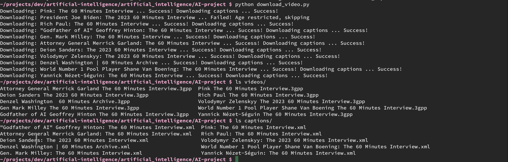
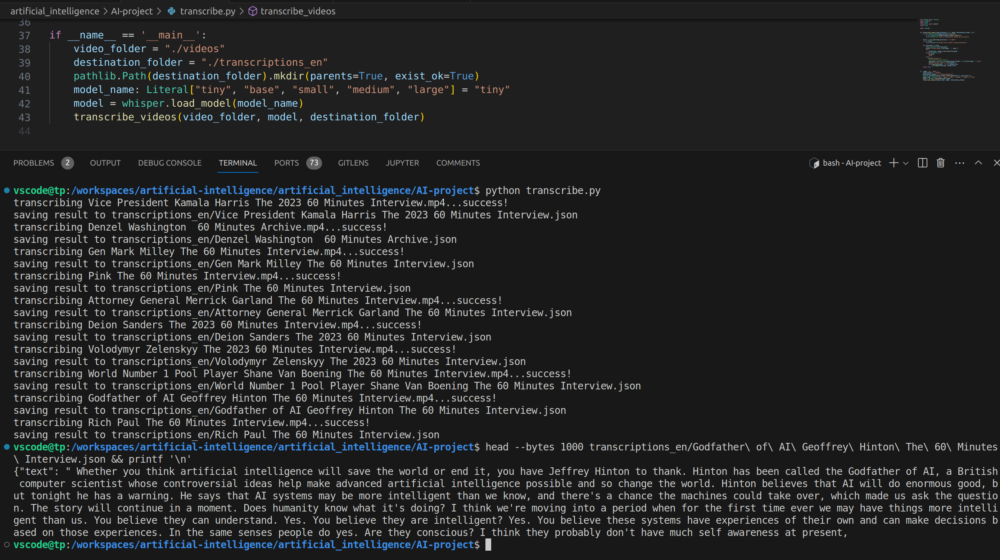
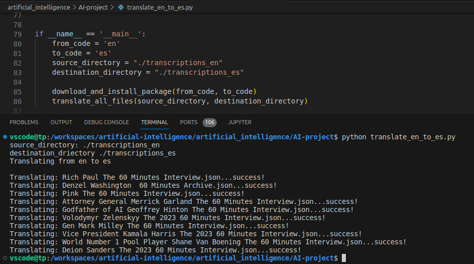
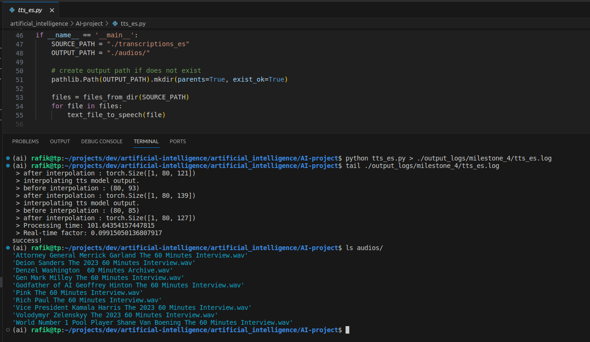

# AI Project Fall 2023
Members:
  - Rafik Saad
  - Banani Ghosh

## Milestone 1
Use pytube API to download 10 videos & captions from "60 Minutes" YouTube playlist

console outputs

[Milestone1 console output2](output_logs/milestone_1/caption_string_output.log)

## Milestone 2
Use openAI/Whisper to convert video to text (transcribe video)

console output

## Milestone 3
Use python argostranslate (OpenNMT) to translate English transcriptions to Spanish

console output

## Milestone 4
Use TTS to convert Spanish transcription to speech

console output

Log:
[Milestone4 log](output_logs/milestone_4/tts_es.log)
